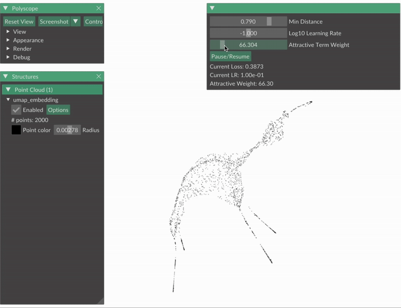

# umap-interactive
A clear, PyTorch-based reimplementation of UMAP with interactive visualizations and hyperparameter controls for learning and research.

Can run on both cuda and Apple M chips

## Demo



## Installation

```bash
pip install -r requirements.txt
```
## Usage

This repository contains two demo files:
- `demo1_official.py`: The official UMAP implementation for comparison
- `demo1_ours.py`: Our interactive PyTorch implementation

Our implementation allows you to interactively control key UMAP parameters in real-time:
- `min_dist`: Controls how tightly points cluster together
- `negative_sampling_rate`: Controls the balance between attractive and repulsive forces
- Other parameters like learning rate can also be adjusted

Run either demo with:

```bash
python demo1_ours.py
```


